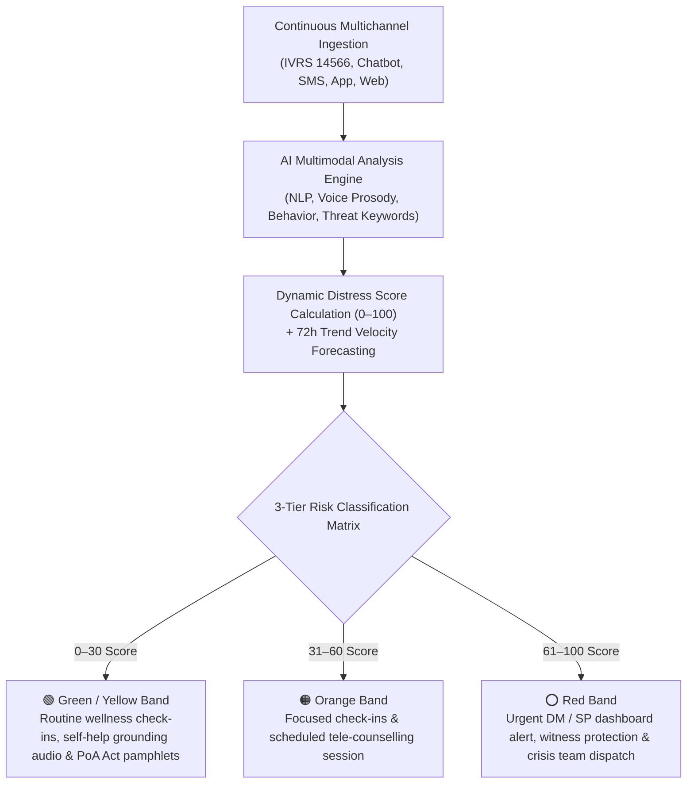

# 🌟 KEFI AI: AI-Powered Dynamic Mental Health Monitoring & Distress Prediction System for Victims of Atrocities

> **Smart India Hackathon (SIH) 2026 — Problem Statement ID: SIH26094**  
> **Ministry**: Ministry of Social Justice and Empowerment (MoSJE) / MIC  
> **Category**: Software | **Technology Bucket**: MedTech / BioTech / HealthTech  

---

## 🏛️ Project Identity & Greek Origin

* **Brand Name**: **KEFI AI** (4 Letters)
* **Greek Origin & Meaning**: Derived from ***Kéfi* (Κέφι)** — the Greek spirit of joy, emotional vitality, passion, and inner healing after adversity and trauma!
* **Acronym Expansion**: **K**inematic **E**motion & **F**orecasting **I**ntervention System (**KEFI**).

---

## 🎯 Problem Statement Overview

Victims and witnesses of atrocities under the **Scheduled Castes and Scheduled Tribes (Prevention of Atrocities) Act, 1989** frequently suffer from prolonged psychological trauma and distress long after filing a complaint. Existing statutory mechanisms focus primarily on post-hoc financial compensation and legal procedures, but lack continuous mental health tracking or early distress crisis prediction.

**KEFI AI** provides continuous, proactive mental health tracking, dynamic distress scoring, 72-hour crisis forecasting, explainable AI attributions, and automated intervention dispatch across legal, investigation, court trial, compensation, and rehabilitation phases.

---

## 📐 Mathematical Multi-Signal Scoring Engine

KEFI AI calculates a continuous **Dynamic Distress Score (DDS: 0–100)** using the weighted multi-signal formula:

$$DDS = w_1 E + w_2 V + w_3 B + w_4 H + w_5 C + w_6 T$$

Where:
* $E$ ($0.25$): Emotion & NLP Sentiment Score (Fear, Hopelessness, Sadness)
* $V$ ($0.20$): Vocal Acoustic Prosody Stress Index (Pitch tremor Hz, Jitter %, Pause gaps)
* $B$ ($0.15$): Behavioral Check-in Gap Rate (Missed periodic wellness calls)
* $H$ ($0.15$): Historical Trend Velocity ($\Delta DDS / \Delta t$ over past 7 days)
* $C$ ($0.10$): Case Stage Pressure (Court hearing proximity & legal delays)
* $T$ ($0.15$): Threat & Intimidation Language Keyword Density ('dhamki', 'withdraw', 'court')

---

## 🛡️ Risk Classification & Action Matrix



---

## ✨ Key Platform Features

### 1. Multichannel Check-ins & Onboarding
- Registration via NHAA (14566), Integrated Portal, Mobile App, IVRS, or Web Portal.
- Secure onboarding with OTP authentication, DPDP Act 2023 digital consent, and AES-256 encryption.

### 2. Interactive Granular Emotion Wheel (Plutchik-based)
- 6 core emotional categories (*Scared/Intimidated*, *Sad/Isolated*, *Angry/Resentful*, *Anxious/Overwhelmed*, *Exhausted/Burnout*, *Calm/Hopeful*).
- Allows victims who cannot express feelings verbally to tap an emotion and receive instant tailored support.

### 3. Calm Space & Silent Support Sanctuary
- 🌬️ **Box Breathing Guide**: Interactive expanding visual circle with 4-4-4-4 rhythm.
- 👀 **5-4-3-2-1 Sensory Grounding Tool**: Step-by-step interactive checklist.
- 🎧 **Calming Ambient Audio Player**: Ocean Waves 🌊, Gentle Rain 🌧️, Forest Breeze 🌲.
- 📷 **Silent Mode & Body Language Detection**: Camera/wearable simulation tracking face affect, heart rate, posture tension for users who cannot speak or type.

### 4. Progress Dashboard & Weekly Report Card
- 7-day interactive chart tracking Dynamic Distress Score (DDS) & Mood trends.
- Weekly Clinical Summary Card (e.g. 5/7 Days Active, Avg Distress 24/100, 12 Micro-goals completed, 🟢 Low Risk).

### 5. Tanglish & Multilingual Conversational AI
- Supports **Tanglish (தமிழ்-English)**, Tamil, Hindi, and English.
- Tanglish AI engine responds empathetically: *"Naan unga feelings-ah purinjukuren. Kavalapadadhinga, naan irukken..."*

### 6. Privacy & Consent Control (DPDP Act 2023)
- Granular consent toggles for sharing data with Field Welfare Officers, Legal Aid Counsel, Anonymous Research Mode, Data Export, and Consent Revocation.

---

## 🛠️ Technology Stack

* **Backend**: Python 3.12, FastAPI, PyTorch, Transformers (BERT), Uvicorn, SQLite / PostgreSQL
* **Frontend**: React 18, Vite 8, Tailwind CSS, face-api.js, Web Speech API
* **Security & Compliance**: AES-256 Encryption, DPDP Act 2023 Data Minimization, OTP Verification

---

## 🚀 Quick Start Guide

### 1. Clone & Set Up Remote
```bash
git clone https://github.com/balajikrishnan031/SIH-KEFI.git
cd SIH-KEFI
```

### 2. Run Backend Server (FastAPI)
```bash
cd Platform/Backend
pip install -r requirements.txt
python -m uvicorn main:app --host 127.0.0.1 --port 8000
```
API Documentation available at: `http://127.0.0.1:8000/docs`

### 3. Run Frontend (React + Vite)
```bash
cd Platform/Frontend
npm install
npm run dev
```

---

## 📄 Submission Documents

- **PDF Presentation**: [`SIH26094_KEFI_AI_OFFICIAL_SUBMISSION.pdf`](./SIH26094_KEFI_AI_OFFICIAL_SUBMISSION.pdf)
- **PowerPoint Deck**: [`SIH26094_KEFI_AI_OFFICIAL_SUBMISSION.pptx`](./SIH26094_KEFI_AI_OFFICIAL_SUBMISSION.pptx)
- **Portal Copy-Paste Text**: [`SIH26094_Portal_Submission_Text.md`](./SIH26094_Portal_Submission_Text.md)
